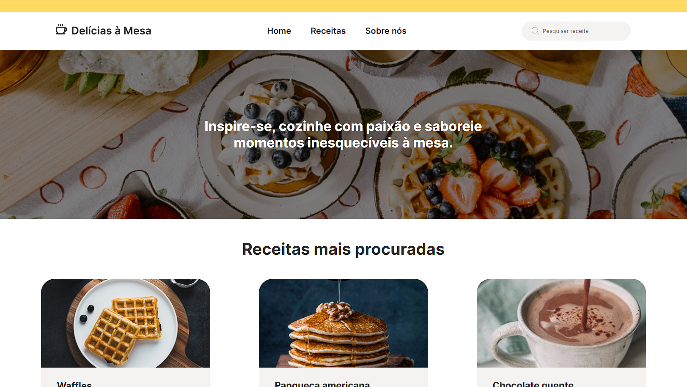

# Delícias à Mesa
Este projeto foi construído com base no figma criado por Kim Freitas em: [Dribble do Kim](https://dribbble.com/shots/21665555-Site-de-receitas-de-comida-Del-cias-Mesa).

Ele se trata de um site de receitas e foi desenvolvido utilizando HTML, CSS e Javascript.

Você pode acessar o preview do site em: [@DeliciasÀMesa](https://jessicavsampaio.github.io/delicias-a-mesa/)

## 🛠️ Tecnologias
* HTML
* CSS
* JavaScript

## Próximos passos
- [ ] Criar responsividade das páginas
- [ ] Aplicar tema light/dark

## ✒️ Autor
* **[Jéssica Vieira](https://github.com/jessicavsampaio)** - *Desenvolvedora*
* **[Kim Freitas](https://github.com/darrow12)** - *UI/UX designer*
